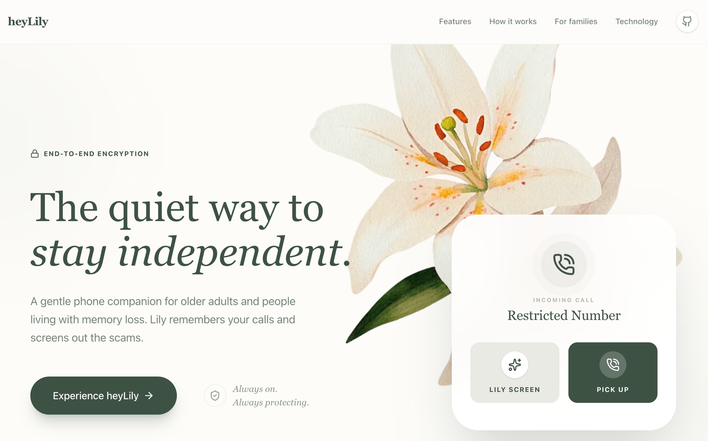
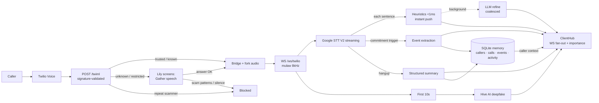

# lilyServes

<p align="center">
  <a href="https://heylily.vercel.app"></a>
</p>

<p align="center">
  <b>▶ Try the demo — <a href="https://heylily.vercel.app">heylily.vercel.app</a></b>
  <br>
  <sub>Site source: <a href="https://github.com/gurul/lilyWebsite">gurul/lilyWebsite</a></sub>
</p>

**Live scam protection and call memory for phone calls.** The real-time backend behind [heyLily](https://heylily.vercel.app) — a gentle phone companion for older adults and people living with memory loss. Lily remembers your calls and screens out the scams.

A scam call only works while it is happening. By the time a transcript is reviewed, or a family member hears about the gift cards, the money is gone. lilyServes sits between the phone and the outside world: unknown callers are screened before the phone ever rings, every bridged call is transcribed and risk-scored sentence by sentence, a synthetic-voice check runs on the first seconds of audio, and the family dashboard hears about it live — during the conversation, not after it.

## Features

- **Call screening.** Trusted callers ring straight through. Restricted, anonymous, and first-time callers are answered by Lily first ("May I ask who's calling?"); the answer is risk-scored and the call is bridged or politely declined. Repeat scammers are blocked outright. Every screen shows up on the dashboard as a *Stayed safe* event.
- **Live scam detection, research-grounded.** A sub-millisecond heuristic engine (gift cards, wire transfers, urgency, secrecy, grandparent-scam patterns, remote-access requests, verification-code requests, …) scores every sentence instantly; a criteria-rubric LLM tier delivers an authoritative scam / uncertain / safe verdict asynchronously. Signals fuse through an EWMA accumulator with dual thresholds, payment-stage language escalates immediately, and the displayed risk level is monotonic — it can only escalate during a call (citations below).
- **Deepfake detection.** The first ~10 seconds of caller audio go to Hive AI. A synthetic voice multiplies the transcript risk and alerts the family — urgently when the conversation is also suspicious — and can never *lower* a score.
- **Cognitive continuity — lilyMemory.** A purpose-built long-term memory engine. Every call, commitment, trusted contact, and scam encounter becomes a typed memory (`episode` / `commitment` / `person` / `preference` / `win` / `safety`) with importance, confidence, entities, and topics. Recall is hybrid — semantic (embeddings + cosine) fused with lexical (FTS5 BM25), importance, and recency — so when a call starts the dashboard receives genuinely related context about the caller, bridging the gaps for someone living with memory changes. Alongside it, a structured SQLite store tracks caller history, trust, and scam strikes.
- **Event capture (Active Assistance).** "Main St. Pharmacy confirmed pickup for Friday @ 4:00 PM" becomes a structured reminder, extracted mid-call and pushed to the dashboard as an *Event captured* item. Post-call summaries also sweep for missed commitments.
- **Family dashboard, smart updates.** Any number of clients connect over WebSocket and get a full snapshot plus live events. Every item carries an importance level (`info` / `notable` / `important` / `urgent`); only `important+` is flagged `notify: true` — peace of mind, not surveillance.
- **Selective privacy.** `SHARE_TRANSCRIPTS=false` keeps transcript text off the dashboard (risk levels still flow). `RETAIN_TRANSCRIPTS=false` (default) means transcripts are never persisted. Everything that *is* stored — including every memory — passes through redaction that scrubs card numbers, SSNs, and one-time codes, and any memory can be deleted via the API (`DELETE /api/memories/{id}`). You own your data, always. `MEMORY_EMBEDDINGS=false` keeps memory fully offline (lexical recall only).
- **Optional intervention.** With `AUTO_INTERVENE=true`, a call that reaches High risk is redirected to a polite hangup via the Twilio REST API. Off by default — warn, don't act.

## Latency model

Nothing on the audio/transcript hot path awaits an AI provider:

1. Twilio media frames are fed to Google STT through a bounded queue (drop-oldest under stall, so live latency beats completeness).
2. Each final sentence is heuristic-scored inline (<1 ms) and pushed to the dashboard immediately, marked `provisional`.
3. LLM refinement runs as a background task, **coalesced** — one analysis in flight per call; lines arriving mid-flight trigger exactly one re-run. Cost and tail latency stay flat on long calls (rolling 4k-char window, `max_tokens` capped, JSON mode).
4. Deepfake checks, event extraction, and all SQLite writes run off-loop (background tasks / worker thread, WAL mode).
5. Dashboard broadcasts serialize the payload once and fan out concurrently; interim (non-final) transcript fragments are streamed too, so text appears as it's spoken.

## Architecture



## Quick start

Requires Python 3.9+ (3.13 supported — mulaw decode has a pure-Python fallback), a Twilio number, a Google Cloud project with Speech-to-Text enabled, an OpenAI key, and [ngrok](https://ngrok.com) for local development.

```bash
python -m venv .venv && source .venv/bin/activate
pip install -r requirements.txt

gcloud auth application-default login    # or export GOOGLE_APPLICATION_CREDENTIALS

cp .env.example .env                     # fill in the values
python server.py
```

On boot the server opens an ngrok tunnel (unless `PUBLIC_URL` is set), and — if Twilio credentials are present — points your Twilio number's voice webhook at `<public_url>/twiml`. Connect a dashboard to `wss://<public_url>/ws/client?token=<CLIENT_TOKEN>`, then call the number.

### Tests & lint

```bash
pip install -r requirements-dev.txt
pytest          # 53 tests: heuristics, fusion, screening, memory, audio, auth
ruff check .
```

## Configuration

All configuration is environment variables (see `.env.example` for the full annotated list). Credentials belong in `.env`, which is gitignored — never commit keys.

| Variable | Required | Purpose |
|---|---:|---|
| `OPENAI_API_KEY` | Yes | Scam scoring, event extraction, summaries |
| `PROJECT_ID` | Yes | Google Cloud project for Speech-to-Text V2 |
| `FORWARD_TO` | Yes | Number calls are bridged to |
| `TWILIO_ACCOUNT_SID` / `TWILIO_AUTH_TOKEN` | Recommended | Webhook auto-config **and webhook signature validation** — without the token, webhooks are unauthenticated (dev only) |
| `CLIENT_TOKEN` | Recommended | Shared secret for the dashboard WS + REST; unset = open (dev only) |
| `SCREEN_UNKNOWN_CALLERS` | No | Default `true` — Lily answers unknown callers first |
| `TRUSTED_NUMBERS` | No | Comma-separated allowlist that always rings through |
| `HIVE_API_SECRET` | No | Deepfake detection; skipped if unset |
| `AUTO_INTERVENE` | No | Default `false` — hang up High-risk calls automatically |
| `RETAIN_TRANSCRIPTS` / `SHARE_TRANSCRIPTS` | No | Privacy controls (persist / stream transcript text) |
| `PUBLIC_URL`, `NGROK_ENABLED`, `PORT`, `DATA_DIR`, `LOG_LEVEL` | No | Deployment knobs |
| `SCAM_MODEL`, `SUMMARY_MODEL`, `EVENT_MODEL` | No | Model overrides |

## Endpoints

| Route | Kind | Auth | Purpose |
|---|---|---|---|
| `POST /twiml` | HTTP | Twilio signature | Voice webhook: screening decision → bridge / screen / block |
| `POST /screen/result` | HTTP | Twilio signature | Screening answer assessment → bridge or decline |
| `GET /health` | HTTP | — | Liveness, active calls, connected clients |
| `/ws/twilio` | WebSocket | — | Twilio Media Streams ingress |
| `/ws/client` | WebSocket | `?token=` | Dashboard egress: snapshot on connect, then live events |
| `GET /api/activity` · `/api/events` · `/api/calls` · `/api/caller/{number}` | HTTP | token | Activity feed, open reminders, call history, caller context |
| `POST /api/events/{id}/complete` | HTTP | token | Mark a reminder done |
| `POST /api/contacts/trusted` | HTTP | token | Add/remove a trusted contact (also remembered as a `person` memory) |
| `GET /api/memories` · `GET /api/memories/search?q=` | HTTP | token | Browse / hybrid-search long-term memories |
| `DELETE /api/memories/{id}` | HTTP | token | Forget a memory permanently |

Events pushed on `/ws/client` (all carry `importance` and `notify`):

| `event` | When |
|---|---|
| `snapshot` | On connect: active calls, recent activity, open events |
| `call_started` | Stream starts — includes `caller_context` (name, history, open commitments) |
| `caller_memories` | Moments later: hybrid-recalled long-term memories about this caller |
| `transcript_interim` / `transcript_update` | As words are spoken / each final sentence (instant provisional risk) |
| `scam_update` | LLM-refined risk level |
| `deepfake_result` | Once, ~10 s in |
| `event_captured` | A commitment was extracted mid-call |
| `activity` | Feed items: *Stayed safe*, *Event captured*, screening, alerts |
| `call_summary` | On hangup: structured summary, indicators, recommended action |

## Project layout

```
server.py                  entry point — python server.py
lily/
├── app.py                 FastAPI app: webhooks, WebSockets, hot-path orchestration, REST
├── config.py              env-driven settings
├── auth.py                Twilio signature validation, dashboard token check
├── calls.py               multi-call registry and per-call session state
├── hub.py                 dashboard fan-out + importance/notification tagging
├── screening.py           screening routes, answer assessment, TwiML builders
├── events.py              commitment extraction with a cheap trigger gate
├── summarizer.py          shared OpenAI client, structured post-call summary
├── transcription.py       STT V2 stream, bounded queue, reconnect-before-timeout
├── audio.py               mulaw → WAV, pure-Python fallback for 3.13+
├── detection/
│   ├── heuristics.py      instant regex risk engine (16 weighted patterns)
│   ├── detector.py        criteria-rubric LLM tier, 3-way verdict
│   ├── fusion.py          EWMA multi-signal risk fusion, kill-chain stages
│   └── deepfake.py        Hive AI check over a warm pooled connection
└── memory/
    ├── models.py          typed memories (episode/commitment/person/preference/win/safety)
    ├── embeddings.py      OpenAI embeddings, injectable provider
    ├── store.py           SQLite + FTS5 + in-process vector index
    ├── service.py         hybrid recall facade (cosine + BM25 + salience)
    └── operational.py     callers/calls/events/activity store; PII redaction
tests/                     53 unit tests (no network required)
```

## Research grounding

The detection layer implements findings from the 2020–2026 vishing-detection literature:

- **Criteria-rubric prompting with a 3-way verdict** (scam / uncertain / safe): criteria-prompted LLMs hold ~95% accuracy under adversarial rephrasing while keyword classifiers collapse; UNCERTAIN trades a little recall for the precision that preserves trust in alerts ([arXiv:2506.06180](https://arxiv.org/abs/2506.06180), [arXiv:2502.03964](https://arxiv.org/abs/2502.03964))
- **EWMA risk accumulation behind dual thresholds** (soft-warn / hard-alert) instead of independent per-sentence verdicts ([arXiv:2509.05362](https://arxiv.org/abs/2509.05362))
- **Immediate escalation on payment-stage markers** — scam-progression studies show only 1–2 conversational turns of lead time once payment language appears ([arXiv:2605.12243](https://arxiv.org/abs/2605.12243)); the regex tier escalates but never clears, because keyword features are exactly what adversarial rephrasing removes ([arXiv:2507.16291](https://arxiv.org/abs/2507.16291))
- **Deepfake score as a risk multiplier, not a standalone alarm** — 8 kHz telephony destroys the high-frequency artifacts detectors depend on ([arXiv:2411.00121](https://arxiv.org/abs/2411.00121))
- **PII sanitization before any cloud LLM call** ([arXiv:2510.18493](https://arxiv.org/abs/2510.18493))

## Security & privacy posture

- Twilio webhooks are HMAC-validated (`X-Twilio-Signature`) whenever `TWILIO_AUTH_TOKEN` is set; unset is loudly logged as dev mode.
- Dashboard WS and REST require `CLIENT_TOKEN` (constant-time compare); unset is loudly logged as dev mode.
- Minimal retention by default: no transcript persistence, summaries only, all stored text redacted (cards / SSNs / one-time codes).
- No phone numbers or secrets in source; everything comes from the environment.

## Known limitations

- Call state is in-memory and single-process (SQLite memory survives restarts; in-flight calls do not).
- Only the caller's inbound track is transcribed; the recipient's replies are not analyzed.
- Screening uses heuristics only on the spoken answer — a calm, novel scam opening will get bridged (and then caught by live scoring).
- The dashboard is a protocol, not a UI — the heyLily frontend consumes it.

## Built with

FastAPI, Twilio Voice + Media Streams, Google Cloud Speech-to-Text V2, OpenAI, Hive AI, SQLite, and ngrok.
