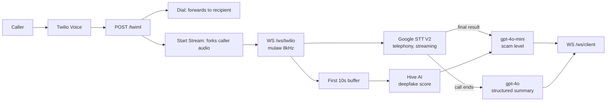

# lilyServes

**Live scam detection for phone calls.** The real-time call-listening backend behind [heyLily](https://github.com/gurul/lilyWebsite), a gentle AI phone companion for older adults and the family who support them.

A scam call only works while it is happening. By the time a transcript is reviewed, or a family member hears about the gift cards, the money is gone. lilyServes listens to a call as it rings through — the caller's audio is streamed off Twilio, transcribed sentence by sentence, and rated for scam risk on every new sentence — so the warning arrives during the conversation rather than after it. The call itself is untouched: the stream is forked, the phone still rings, and the person on the line talks to whoever called them.

Alongside the transcript it checks whether the voice on the line is real. The first ten seconds of audio go to Hive AI's deepfake detector, which matters for the grandparent scam in its current form: a cloned voice saying it is your grandson, in trouble, needing money now. A synthetic voice cannot lower the risk score, only raise it.

## What it does

1. **Answers the call.** Twilio hits `/twiml`, which returns TwiML that forks the caller's audio to a WebSocket and dials the real destination in the same breath.
2. **Streams the audio.** `/ws/twilio` receives base64 mulaw frames, 8 kHz mono, as Twilio's media stream produces them.
3. **Transcribes continuously.** Google Speech-to-Text V2 runs a bidirectional gRPC stream with the `telephony` model, emitting interim and final results and silently reconnecting before Google's ~5 minute per-stream limit.
4. **Scores every sentence.** Each final transcript line triggers `gpt-4o-mini` over the full transcript so far, returning `Low` / `Medium` / `High` with a one-line reason.
5. **Checks the voice is human.** The first ~10 seconds (80,000 mulaw bytes) are converted to WAV and sent once to Hive AI. A deepfake score at or above `0.5` floors the risk at `Medium`.
6. **Pushes to the frontend.** Every transcript line, score, and deepfake verdict goes out over `/ws/client` as it happens.
7. **Summarizes on hangup.** `gpt-4o` produces a structured post-call JSON: summary, scam indicators, risk level, recommended action.

## Architecture



Call state lives in a plain in-memory dict keyed by Twilio `callSid`; there is no database and nothing is persisted after the call ends. Deepfake detection runs as a detached task so a slow Hive response never stalls transcription. Only `inbound_track` is streamed, so the transcript is the caller's side of the conversation.

## Quick start

Requires **Python 3.9–3.12** (the `audioop` module used for mulaw conversion was removed in 3.13), an [ngrok](https://ngrok.com) account, a Twilio number, a Google Cloud project with the Speech-to-Text API enabled, and an OpenAI key.

```bash
python -m venv .venv && source .venv/bin/activate
pip install -r requirements.txt

gcloud auth application-default login    # or export GOOGLE_APPLICATION_CREDENTIALS

cp .env.example .env                     # then fill in the values below
python server.py
```

On boot the server opens an ngrok tunnel, prints the public URL, and — if Twilio credentials are present — points your first Twilio number's voice webhook at `<public_url>/twiml` automatically. Without them it prints the URL to paste into the Twilio console by hand.

Connect the frontend to `wss://<public_url>/ws/client`, then call the Twilio number. A client that connects before the call arrives is queued and attached when the stream starts.

## Configuration

Credentials belong in `.env`, which is gitignored. Never commit API keys.

| Variable | Required | Purpose |
|---|---:|---|
| `OPENAI_API_KEY` | Yes | Scam scoring (`gpt-4o-mini`) and call summary (`gpt-4o`) |
| `PROJECT_ID` | Yes | Google Cloud project for Speech-to-Text V2. Defaults to `heylily` |
| `GOOGLE_APPLICATION_CREDENTIALS` | Yes | Service-account JSON path, unless you use `gcloud` ADC |
| `TWILIO_ACCOUNT_SID` | No | Auto-configures the voice webhook on boot. Without it, set the webhook manually |
| `TWILIO_AUTH_TOKEN` | No | Pairs with the SID above |
| `HIVE_API_SECRET` | No | Hive AI deepfake detection. Without it the check is skipped and scoring runs on transcript alone |
| `FORWARD_TO` | No | Number the call is bridged to. Defaults to a demo number — set this |
| `PORT` | No | Server port, defaults to `8000` |

## Endpoints

| Route | Kind | Purpose |
|---|---|---|
| `POST /twiml` | HTTP | Twilio voice webhook. Returns TwiML that forks audio and dials `FORWARD_TO` |
| `GET /health` | HTTP | Liveness plus active call count |
| `/ws/twilio` | WebSocket | Twilio Media Streams ingress: `connected`, `start`, `media`, `stop` |
| `/ws/client` | WebSocket | Frontend egress. Send nothing; receive the events below |

Events pushed to `/ws/client`:

| `event` | When | Payload |
|---|---|---|
| `transcript_update` | Every final transcript line | `text`, `full_transcript`, `scam: {scam_level, reasoning}` |
| `deepfake_result` | Once, ~10s in (or at hangup if the call is shorter) | `deepfake_score`, `is_deepfake` |
| `call_summary` | On hangup | `summary` (JSON string), `scam_level`, `deepfake_score` |

All three also carry `call_sid`.

## Project layout

| Path | What |
|---|---|
| `server.py` | FastAPI app: TwiML, both WebSockets, call state, lifespan ngrok + Twilio wiring |
| `google_transcriber.py` | `GoogleStreamingSession` — STT V2 bidirectional stream, chunking, reconnect-before-timeout |
| `scam_detector.py` | Per-sentence `Low`/`Medium`/`High` scoring, with deepfake escalation |
| `deepfake_client.py` | mulaw → WAV conversion and the Hive AI call |
| `summarizer.py` | Shared OpenAI client and the post-call structured summary |
| `transcriber.py` | Legacy Whisper transcription, superseded by `google_transcriber.py`. Unused and non-functional |
| `assets/` | Press image from the PSL pitch |

## Known limitations

This is demo-stage code, shaped by a live pitch rather than production traffic.

- State is in-memory and single-process. Restarting drops every active call.
- `/ws/client` has no authentication and pairs first-come with whichever call starts next, so it assumes one call and one viewer at a time.
- Only the inbound track is transcribed. The recipient's replies are not in the transcript.
- ngrok is started unconditionally in the app lifespan, which is convenient for demos and wrong for a deployed service.
- Scam scoring re-sends the full transcript on every final line, so cost grows with call length.

## Built with

FastAPI, Twilio Voice and Media Streams, Google Cloud Speech-to-Text V2, OpenAI `gpt-4o` / `gpt-4o-mini`, Hive AI deepfake detection, and ngrok.
